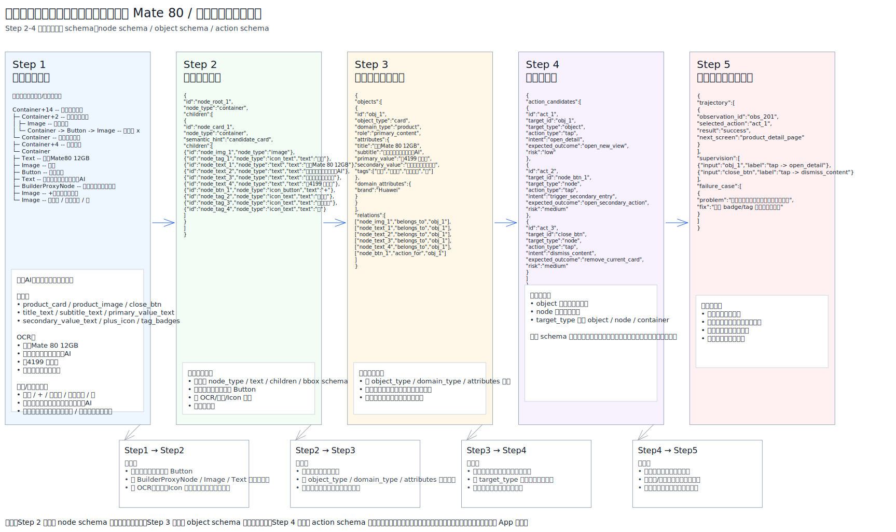
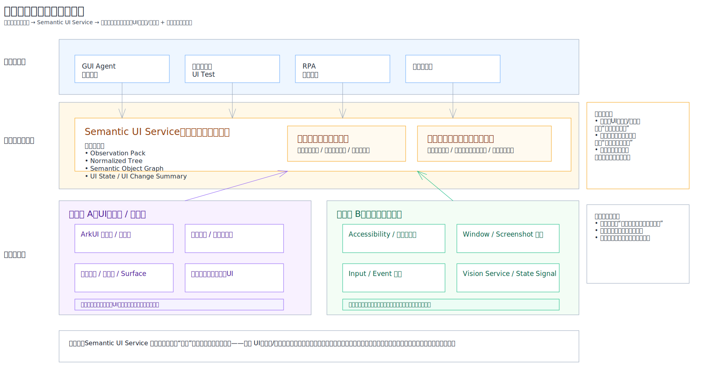

# GUI 语义记忆系统与语义化控件树技术方案设计

## 1. 背景与问题定义

现有 GUI 操控系统大多依赖以下输入之一：

- 原始控件树及节点属性（Accessibility Tree / Semantics Tree / DOM，包括 role/type、text、accessibility label、clickable、enabled、bounds、state 等）
- 屏幕截图
- 视觉补充信息（OCR、图标识别、目标检测、图片/区域语义等）

如果系统进一步做经验学习和动作语义归纳，还会使用历史轨迹和执行反馈，例如动作前页面、动作、动作后页面和成功/失败结果。这类信息不属于单次静态页面观测，而更适合作为动作图构建、离线语义编译和执行反馈回流的输入。

这些单次页面观测虽然能支持基础自动化，但对 GUI Agent 仍然存在明显不足：

1. **结构有余，语义不足**
   能知道“这是一个 Button / Text / Image”，但不知道它是不是“商品卡片”“关闭按钮”“筛选入口”“价格字段”。

2. **节点很多，但任务信息稀疏**
   原始控件树中包含大量纯布局节点、装饰节点、无效容器和中间层级，对模型不友好。

3. **缺少对象级表示**
   标题、价格、标签、按钮在树里是分散节点，但在任务层面往往属于同一个“商品对象”或“设置项对象”。

4. **缺少动作语义**
   现有树通常只能表达“可点击”，但无法表达“点击后大概率会进入详情页”“该按钮是关闭动作”“该动作风险较高”。

因此，需要设计一套 **语义化控件树（Semantic UI Representation）**，将原始界面观测提升为面向 GUI Agent 的语义对象图与动作空间。

在整体工程中，语义化控件树可以进一步上升为 **GUI 语义记忆系统（GUI Semantic Memory System）** 的核心中间表示。该系统的目标不是每次运行时都用强模型重新理解界面，而是将用户或 GUI Agent 的真实操作轨迹沉淀为可复用的页面模板、对象语义和动作语义，使运行时能够快速生成当前页面的实例级语义对象图。

---

## 2. 目标

语义化控件树的目标不是简单增强原始控件树，而是将 GUI 表示从“控件集合”升级为“对象世界 + 动作空间”。

具体目标包括：

- 提升 GUI Agent 对界面的语义理解能力
- 将多个离散节点聚合为可操作对象
- 显式表达对象属性、对象关系与动作语义
- 支持更稳定的目标检索、动作规划和安全执行
- 为执行反馈学习提供更高质量的中间表示

一句话概括：

> 将原始界面观测加工成面向 GUI Agent 的语义对象图与动作图。

---

## 3. 总体架构

整体技术链路建议分为五步：

1. **多源观测采集**
2. **规范化控件树构建**
3. **语义对象化**
4. **动作图构建**
5. **执行反馈回流**

对应产物如下：

- Step 1: `Observation Pack`
- Step 2: `Normalized Tree`
- Step 3: `Semantic Object Graph`
- Step 4: `Action Graph`
- Step 5: `Execution Feedback / Training Data`

### 3.1 架构示意图

为了更直观地理解第 3 章中的总体架构，建议结合以下两张图一起阅读：

- 图 1：语义化控件树架构图
  该图对应本方案的主处理链路，展示了从真实界面样例出发，如何经过 `Observation Pack`、`Normalized Tree`、`Semantic Object Graph`、`Action Graph` 等阶段，逐步完成语义化提升。



- 图 2：鸿蒙语义服务层分层落位图
  该图对应本方案在鸿蒙系统中的工程落位方式，说明语义服务层如何连接上层调用方、语义处理链路，以及下层鸿蒙系统组件与渲染框架。


---

## 4. Step 1：多源观测采集

### 4.1 输入来源

语义化控件树不应只依赖单一控件树，而应融合多源观测：

- 原始控件树 / Accessibility Tree / Semantics Tree / DOM 及其节点属性
- 界面截图
- OCR 文本识别结果
- 目标检测与区域分割结果
- 图标识别与图片语义结果

### 4.2 目标

解决原始控件树信息不全的问题，补充以下内容：

- 控件树中不存在的文本
- 图标的语义含义
- 图片、视频帧或商品图中的业务语义
- 可供后续对象边界推断使用的 bbox、检测框和布局线索

### 4.3 产物

```json
{
  "tree": "...",
  "screenshot": "...",
  "visual": {
    "ocr": [],
    "detections": [],
    "icons": [],
    "image_tags": []
  }
}
```

---

## 5. Step 2：规范化控件树

### 5.1 目标

将原始控件树及其补充观测统一到稳定、干净、平台无关的控件树表示中。

### 5.2 核心任务

#### 5.2.1 去噪
删除或压缩以下节点：

- 冗余容器
- 纯装饰节点
- 无效中间层级
- 无业务意义的无效 Button / Container

#### 5.2.2 类型归一化
将不同平台或框架中的节点类型统一为通用类型，例如：

- `container`
- `text`
- `image`
- `icon_button`
- `icon_text`
- `input`
- `checkbox`
- `switch`

#### 5.2.3 文本归并
合并以下文本来源：

- 控件树原始 text
- content-desc / accessibility label
- OCR 结果
- 图标识别文本

#### 5.2.4 观测结果挂接
将 OCR、检测、icon 识别结果挂接到对应节点字段中。

### 5.3 特点

Step 2 的结果仍然是**树结构**，不做对象级聚合。

### 5.4 推荐 Schema

```json
{
  "id": "node_text_1",
  "node_type": "text",
  "text": "华为Mate 80 12GB",
  "bbox": [44, 318, 220, 344],
  "children": []
}
```

### 5.5 示例

```json
{
  "id":"node_root_1",
  "node_type":"container",
  "children":[
    {
      "id":"node_card_1",
      "node_type":"container",
      "semantic_hint":"candidate_card",
      "children":[
        {
          "id":"node_img_1",
          "node_type":"image",
          "ocr_text":[
            "第二代红枫影像｜鸿蒙AI",
            "超可靠玄武架构",
            "补贴到手价￥4199"
          ],
          "vision_tags":[
            "phone",
            "huawei_mate80"
          ]
        },
        {"id":"node_close_1","node_type":"icon_button","text":"x"},
        {
          "id":"node_info_1",
          "node_type":"container",
          "children":[
            {"id":"node_tag_1","node_type":"icon_text","text":"自营"},
            {"id":"node_text_1","node_type":"text","text":"华为Mate 80 12GB"},
            {"id":"node_text_2","node_type":"text","text":"第二代红枫影像｜鸿蒙AI"},
            {"id":"node_text_3","node_type":"text","text":"华为京东自营旗舰店"},
            {"id":"node_text_4","node_type":"text","text":"￥4199 国补价"},
            {"id":"node_btn_1","node_type":"icon_button","text":"+"},
            {"id":"node_tag_2","node_type":"icon_text","text":"明日达"},
            {"id":"node_tag_3","node_type":"icon_text","text":"国家补贴"},
            {"id":"node_tag_4","node_type":"icon_text","text":"赠"}
          ]
        }
      ]
    }
  ]
}
```

---

## 6. Step 3：语义对象化

### 6.1 目标

从规范化控件树中识别候选对象，并将多个节点聚合为一个高层语义对象。

### 6.2 Step 2 到 Step 3 的核心变化

Step 2 还是“树中的节点”，而 Step 3 要开始表达：

- 这是一个什么对象
- 这个对象包含哪些组成节点
- 这个对象有哪些摘要属性
- 哪些节点与对象之间存在 `belongs_to` 或 `action_for` 关系

### 6.3 关键任务

#### 6.3.1 对象候选识别
例如识别：

- 商品卡片
- 聊天气泡
- 设置项
- POI 卡片
- 列表项

#### 6.3.2 对象边界推断

推断哪些节点共同构成一个语义对象，以及该对象在页面上的视觉区域。

这一步解决的是“控件树未显式表达对象边界”的问题。例如，一个商品卡片可能由图片、标题、价格、店铺名、标签和按钮等多个节点组成，原始控件树里未必有一个干净的 `product_card` 容器节点。此时需要结合 bbox、布局、截图、视觉检测结果和相邻关系推断：

- 哪些节点属于同一个对象
- 对象的整体区域边界是什么
- 哪些节点只是装饰或背景
- 哪些可点击节点是对象主入口或局部动作

#### 6.3.3 节点角色标注
为关键节点打上角色标签，例如：

- `title_part`
- `subtitle_part`
- `primary_value_part`
- `secondary_value_part`
- `tag_part`
- `entry_action`
- `dismiss_action`

#### 6.3.4 属性摘要
将多个节点上的信息聚合成对象属性：

- `title`
- `subtitle`
- `primary_value`
- `secondary_value`
- `tags`

#### 6.3.5 关系建模
建立高阶关系：

- `belongs_to`
- `action_for`

### 6.4 推荐对象 Schema

为了兼顾通用性与语义表达能力，建议对象层使用以下结构：

```json
{
  "id":"obj_1",
  "struct_type":"card",
  "semantic_type":"product_card",
  "semantic_label":"商品卡片",
  "task_role":"primary_content",
  "source_node_id":"node_card_1",
  "attributes":{
    "title":"华为Mate 80 12GB",
    "subtitle":"第二代红枫影像｜鸿蒙AI",
    "primary_value":"￥4199 国补价",
    "secondary_value":"华为京东自营旗舰店",
    "tags":["自营","明日达","国家补贴","赠"]
  },
  "domain_attributes":{
    "brand":"Huawei"
  }
}
```

### 6.5 字段说明

#### `struct_type`
表示结构形态，例如：

- `card`
- `list_item`
- `dialog`
- `menu_item`
- `input_group`

#### `semantic_type`
表示语义类别，例如：

- `product_card`
- `message_bubble`
- `setting_item`
- `poi_card`
- `video_card`

#### `semantic_label`
给人看的可读标签，例如：

- 商品卡片
- 设置项
- 聊天气泡

#### `task_role`
表示对象在当前页面或任务中的角色，例如：

- `primary_content`
- `secondary_content`
- `action_entry`
- `navigation_entry`
- `filter_option`

### 6.6 节点保留策略

Step 3 中不建议简单删除 Step 2 的节点。更合理的方式是：

- 节点级表示仍然保留
- 对象级摘要同时生成

例如 `node_tag_*` 可以：

- 在对象属性中聚合为 `attributes.tags`
- 同时仍作为 `tag_part` 节点保留在 `nodes` 中

这样可以兼顾：

- 简洁性
- 可追溯性
- 可交互性表达

### 6.7 示例

```json
{
  "objects":[
    {
      "id":"obj_1",
      "struct_type":"card",
      "semantic_type":"product_card",
      "semantic_label":"商品卡片",
      "task_role":"primary_content",
      "source_node_id":"node_card_1",
      "attributes":{
        "title":"华为Mate 80 12GB",
        "subtitle":"第二代红枫影像｜鸿蒙AI",
        "primary_value":"￥4199 国补价",
        "secondary_value":"华为京东自营旗舰店",
        "tags":[
          "自营",
          "明日达",
          "国家补贴",
          "赠"
        ]
      },
      "domain_attributes":{
        "brand":"Huawei"
      }
    }
  ],
  "nodes":[
    {"id":"node_img_1","role":"image_part","text":null},
    {"id":"node_close_1","role":"dismiss_action","text":"x"},
    {"id":"node_text_1","role":"title_part","text":"华为Mate 80 12GB"},
    {"id":"node_text_2","role":"subtitle_part","text":"第二代红枫影像｜鸿蒙AI"},
    {"id":"node_text_3","role":"secondary_value_part","text":"华为京东自营旗舰店"},
    {"id":"node_text_4","role":"primary_value_part","text":"￥4199 国补价"},
    {"id":"node_btn_1","role":"entry_action","text":"+"},
    {"id":"node_tag_1","role":"tag_part","text":"自营"},
    {"id":"node_tag_2","role":"tag_part","text":"明日达"},
    {"id":"node_tag_3","role":"tag_part","text":"国家补贴"},
    {"id":"node_tag_4","role":"tag_part","text":"赠"}
  ],
  "relations":[
    ["node_img_1","belongs_to","obj_1"],
    ["node_text_1","belongs_to","obj_1"],
    ["node_text_2","belongs_to","obj_1"],
    ["node_text_3","belongs_to","obj_1"],
    ["node_text_4","belongs_to","obj_1"],
    ["node_tag_1","belongs_to","obj_1"],
    ["node_tag_2","belongs_to","obj_1"],
    ["node_tag_3","belongs_to","obj_1"],
    ["node_tag_4","belongs_to","obj_1"],
    ["node_btn_1","action_for","obj_1"],
    ["node_close_1","action_for","obj_1"]
  ]
}
```

---

## 7. Step 4：动作图构建

### 7.1 目标

在对象图基础上生成当前页面的可执行动作空间。

### 7.2 为什么需要动作图

Step 3 表达的是“这是什么对象”，但 GUI Agent 还需要回答：

- 现在可以做什么动作
- 这些动作分别作用于谁
- 动作后可能发生什么
- 哪些动作更危险

因此需要单独构建 `Action Graph`。

### 7.3 输入来源

动作图不应只依赖 Step 3 的对象图，还需要结合运行时上下文和历史经验。

推荐输入包括：

- Step 3 输出的 `Semantic Object Graph`
- Step 2 保留的可交互节点、节点 bbox、节点状态和可访问性属性
- 当前页面状态，例如当前输入焦点、滚动位置、键盘状态、loading 状态、弹窗状态和页面稳定性
- 可选的交互历史，例如最近点击、滚动、输入、返回等事件
- 可选的 action transition，例如动作前页面、动作、动作后页面、成功/失败结果
- 任务上下文和安全策略，例如当前用户目标、是否允许高风险动作、是否需要二次确认

其中，当前页面状态可以基于当前窗口直接获得；action transition 则必须来自历史轨迹或真实执行后的反馈，不能从单个静态页面直接得到。前者主要用于判断“当前能不能做这个动作”，后者主要用于推断“这个动作通常会导致什么结果”。

### 7.4 推荐 Schema

```json
{
  "id":"act_1",
  "target_id":"obj_1",
  "target_type":"object",
  "action_type":"tap",
  "intent":"open_detail",
  "expected_outcome":"open_new_view",
  "risk":"low"
}
```

### 7.5 字段说明

#### `target_id`
动作作用目标

#### `target_type`
目标类型，例如：

- `object`
- `node`
- `container`

#### `action_type`
动作类型，例如：

- `tap`
- `long_press`
- `scroll`
- `type`
- `dismiss`

#### `intent`
动作意图，即“为什么做这个动作”

例如：

- `open_detail`
- `dismiss_content`
- `trigger_secondary_entry`

#### `expected_outcome`
动作执行后的预期界面变化

例如：

- `open_new_view`
- `remove_current_card`
- `open_secondary_action`

#### `risk`
动作风险等级

例如：

- `low`
- `medium`
- `high`

---

## 8. Step 5：执行反馈回流

### 8.1 目标

把真实执行结果回流成监督样本和经验数据，用于持续优化。

### 8.2 内容

- 轨迹记录
- 成功/失败标记
- 页面变化对齐
- 正负样本构建
- 风险样本归档

### 8.3 示例

```json
{
  "trajectory":[
    {
      "observation_id":"obs_201",
      "selected_action":"act_1",
      "result":"success",
      "next_screen":"product_detail_page"
    }
  ],
  "supervision":[
    {"input":"obj_1","label":"tap -> open_detail"},
    {"input":"node_close_1","label":"tap -> dismiss_content"}
  ],
  "failure_case":[
    {
      "problem":"把权益标签误判为主操作入口",
      "fix":"降低 tag 节点动作优先级"
    }
  ]
}
```

---

## 9. GUI 语义记忆系统工程化方案

### 9.1 系统定位

GUI 语义记忆系统是语义化控件树的工程化产品形态。

它的核心思路是：

> 将“运行时昂贵地理解界面”转化为“离线提前编译界面语义，运行时快速匹配、对齐和复用”。

语义化控件树在其中扮演核心 IR 的角色：

- `Normalized Tree` 负责提供稳定、平台无关的控件结构
- `Semantic Object Graph` 负责表达对象、属性、关系和节点角色
- `Action Graph` 负责表达动作意图、预期后果和风险等级
- `Execution Feedback` 负责把真实操作结果沉淀为可复用经验

因此，该系统不是单纯的缓存，也不是单纯的大模型推理服务，而是一套由端侧观测、端侧语义记忆、云侧模板编译、运行时匹配和反馈闭环共同组成的 GUI 经验基础设施。

### 9.2 核心收益

GUI 语义记忆系统带来的主要收益包括：

1. **降低单步操控时延**
   原来每一步都可能需要多模态模型看截图、理解控件、推理动作。引入语义记忆后，高成本推理可以异步或离线完成，运行时主要做页面匹配、节点对齐和语义填槽。

2. **降低在线模型规模和成本**
   原先 32B 级多模态模型可能同时承担 OCR、视觉 grounding、对象聚合、业务语义理解和动作推理。语义化控件树生成后，在线模型面对的是更干净的对象和动作空间。在高质量模板和动作图覆盖的场景下，在线决策模型有机会降到 3B-8B 级别；固定 App 和固定任务流中，甚至可以进一步由小模型加规则完成。

3. **提升操控准确率和稳定性**
   动作语义不只来自当前截图推断，还来自历史 action transition，即动作前页面、动作、动作后页面之间的真实变化。系统可以更稳定地区分 `open_detail`、`dismiss_content`、`add_to_cart`、`submit` 等动作。

4. **提升可复用性**
   同一 App 或同一页面模板会反复出现。首次识别成本较高，但离线编译后，同类页面、同类卡片和同类任务都可以复用已有语义。

5. **形成持续学习闭环**
   成功轨迹、失败轨迹、用户主动教学和运行时反馈都可以用于修正页面模板、动作语义和风险规则。

6. **提升安全性和可解释性**
   动作图可以显式标注动作风险和预期后果。出错时也能追溯是页面匹配错误、节点对齐错误、对象聚合错误，还是动作语义预测错误。

### 9.3 运行时路径

运行时可以分为冷启动路径和热启动路径。

#### 冷启动路径

首次遇到陌生页面时，系统可能无法立即生成高质量语义化控件树。这时应使用传统方式兜底：

- 原始控件树
- 截图
- OCR
- 本地规则和轻量模型
- 必要时使用多模态模型做单步操控推理

冷启动路径的重点不是立刻达到最高语义质量，而是完成任务并记录高价值样本：

```text
页面 A
用户或 Agent 执行动作 node_x
页面变成 B
动作成功或失败
```

这些 action transition 是后续离线语义编译的核心数据。

#### 热启动路径

当页面模板已经被端侧或云侧学习过，运行时链路变为：

```text
当前页面观测
-> 规范化控件树
-> 页面指纹和结构签名
-> 模板匹配
-> 节点对齐
-> 槽位填充
-> 置信度判断
-> 返回实例级语义对象图和动作图
```

热启动路径在高置信模板命中时，目标是在 100-300ms 内生成可用的语义化控件树，并将其交给 GUI Agent 或小模型进行下一步决策。

### 9.4 端侧与云侧数据体系

整体工程中建议将数据分为端侧个人数据和云侧通用知识两类。

总原则是：

```text
端侧：具体用户、具体页面、具体内容、具体轨迹
云侧：抽象模板、通用语义、模型规则、统计知识
```

| 数据 | 推荐位置 | 作用 | 隐私风险 |
|---|---|---|---|
| 原始观测数据 | 端侧临时 | 控件树、截图、OCR、窗口状态 | 高 |
| 轻量事件指纹 | 端侧 | 页面 hash、结构 hash、action 记录 | 中 |
| Action Transition 轨迹 | 端侧为主 | 动作前页面、动作、动作后页面 | 高 |
| 实例级语义对象图 | 端侧 | 当前用户页面的语义化控件树 | 高 |
| 个人语义记忆缓存 | 端侧 | 用户常用页面的快速匹配和复用 | 中高 |
| 去隐私页面模板库 | 云侧 | App 页面结构模板、对象槽位和动作语义 | 低 |
| 界面模板匹配与语义生成规则 | 云侧生成，端侧下发 | 将当前界面信息匹配到页面模板，并完成节点对齐、槽位填充、动作语义和风险判断 | 低 |
| 脱敏评估与反馈数据 | 端侧优先，云侧可选 | 评估成功率、误操作率、时延和覆盖率 | 中 |

端侧应保存实例级信息，例如当前页面中的商品名、聊天内容、地址、订单号和具体节点映射。云侧适合保存去内容后的页面模板，例如：

```text
某类电商列表页模板：
card = image + title + price + shop + tags
tap card_body -> open_detail
tap plus_button -> add_to_cart
tap close_icon -> dismiss_overlay
```

云侧不应长期保存：

- 原始截图
- 完整 OCR
- 用户具体 action transition
- 实例级语义对象图
- 聊天、表单、订单、支付等高敏页面内容

### 9.5 端侧实例级语义对象图生成

端侧实例级语义对象图不应在运行时强依赖云侧强模型。更合理的模式是：

```text
云侧强模型：离线当老师，生成模板、规则和训练数据
端侧系统：运行时当执行者，匹配模板、对齐节点、填入当前页面内容
```

端侧生成流程如下：

1. **采集当前页面观测**
   获取控件树、截图、OCR、本地可点击节点、bbox、窗口状态和输入焦点。

2. **构建规范化控件树**
   对原始控件树去噪、类型归一、文本合并，并挂接 OCR、图标和检测结果。

3. **生成页面指纹**
   使用结构 hash、布局特征、文本摘要 hash、App/window 信息和可点击节点分布判断当前页面是否像已知模板。

4. **匹配语义模板**
   模板可以来自云侧下发的通用模板，也可以来自端侧沉淀的个人模板。

5. **节点对齐与槽位填充**
   将模板中的 `title_part`、`price_part`、`entry_action` 等槽位映射到当前控件节点，并填入当前页面的具体文本和 bbox。

6. **生成实例级语义对象图与动作图**
   输出当前页面真实可用的 `Semantic Object Graph` 和 `Action Graph`。

7. **置信度判断与降级**
   如果匹配置信度高，直接返回；如果置信度低，则只返回部分语义，或回退到本地规则、小模型、多模态兜底路径。

因此，端侧实例图的最快路径确实是模板匹配，但模板来源不只包括云侧，还包括端侧个人学习、本地规则和轻量模型。

### 9.6 云侧离线语义编译

云侧主要负责低频、重计算、可共享的语义编译工作，而不是每次运行时参与实例图生成。

云侧能力包括：

- 使用强模型复盘脱敏 action transition
- 从多条轨迹中归纳页面模板
- 识别对象类型、节点角色和对象关系
- 预测动作意图、动作后果和风险等级
- 训练或蒸馏端侧轻量模型
- 更新模板库、规则库和风险策略
- 聚合评估模板命中率、误操作率和端到端任务收益

云侧输出的是模板级语义知识，例如：

```text
页面类型：商品列表页
对象类型：product_card
对象槽位：image/title/price/shop/tags/action_button
动作语义：tap card_body -> open_detail
动作风险：tap buy_now -> high
```

端侧再将这些模板实例化为当前用户页面的具体对象。

### 9.7 端侧日常学习策略

端侧日常学习不应在页面每次刷新时完整采集和分析，否则会严重影响续航、性能和隐私感知。

更合理的策略是：

```text
高频事件只做轻量记录
低频关键时刻才保存快照
高价值样本才进入语义分析
耗电任务放到空闲、充电、Wi-Fi、低负载后台执行
```

可以分为四层：

1. **L0：实时轻量监听**
   每次页面变化、控件树变化、点击、滚动、输入时，只记录 app_id、window_id、结构 hash、可点击节点数量、页面文本摘要 hash、action 类型和时间戳。

2. **L1：页面稳定后采样**
   等连续 500ms-1500ms 没有明显 UI 变化，或用户点击后的新页面稳定后，再保存页面状态快照。滚动、动画和 loading 中间帧应跳过。

3. **L2：只分析高价值样本**
   优先处理用户点击前后的页面变化、用户反复访问的高频页面、Agent 失败过的页面、模板库不认识的页面，以及结构稳定但语义缺失的页面。

4. **L3：后台异步语义编译**
   OCR、图标识别、对象聚合、动作语义推断和模板归纳放到后台执行，并受电量、温度、网络、系统负载和用户授权约束。

action transition 比单独页面快照更有价值。系统应优先记录：

```text
页面 A
用户点击 node_x
页面变成 B
```

而不是高频保存大量无动作上下文的页面帧。

### 9.8 隐私与脱敏原则

端侧上传给云侧的数据必须脱敏，并且应优先上传抽象模板数据，而不是原始页面数据。

默认不上云的数据包括：

- 原始截图
- 完整控件树文本
- 完整 OCR
- 用户具体 action transition
- 实例级语义对象图
- 聊天、表单、订单、支付等高敏页面内容

可上传的数据应尽量是：

- 页面结构 hash
- 控件类型分布
- 相对布局关系
- 节点角色占位符
- 匿名化 action 类型
- 动作前后页面类型变化
- 模板匹配置信度和错误类型

如果确实需要云侧强模型分析新页面样本，应满足以下条件：

- 用户明确授权
- 默认排除高敏 App
- 上传前在端侧删除或替换姓名、手机号、地址、订单号、验证码等 PII
- 截图局部化、模糊化或转为结构表示
- 云侧短期处理，不长期保存原始样本
- 云侧长期只保存模板级知识

### 9.9 技术风险与落地边界

GUI 语义记忆系统的关键风险不在于单次强模型推理，而在于运行时复用是否可靠。

主要风险包括：

- **页面匹配错误**：App 版本、A/B 实验、屏幕尺寸、语言和登录态变化都可能导致模板误命中。
- **节点对齐错误**：识别出页面模板后，仍可能把 `title_part`、`price_part`、`submit_action` 等槽位映射到错误节点。
- **语义缓存污染**：离线强模型也会误判，如果错误进入模板库，会被后续反复复用。
- **动作后果不确定**：动作结果可能依赖登录态、权限、网络、库存、弹窗和风控。
- **高风险动作安全问题**：支付、删除、提交、授权、发消息等动作必须保守处理，不能只依赖缓存语义。
- **评估标准复杂**：语义对象图没有唯一标准，最终应以任务成功率、单步准确率、误操作率、时延和成本作为核心指标。

因此落地路线应从高频、低风险、结构稳定的页面开始：

- 商品列表页
- 详情页
- 设置页
- 搜索结果页
- 表单页
- 弹窗

动作上应先支持：

- 打开详情
- 返回
- 关闭
- 滚动
- 输入
- 选择

高风险动作可以先做识别、标注和二次确认，不应在早期直接自动执行。

---

## 10. 总结

语义化控件树的本质，不是把控件树“加几个字段”，而是建立一套完整的 GUI 语义中间表示：

- 从多源观测出发
- 构建规范化控件树
- 聚合为语义对象图
- 进一步生成动作图
- 通过执行反馈持续优化

一句话总结：

> 语义化控件树的实现方式，本质上是一条“多源观测融合 → 规范化控件树 → 语义对象化 → 动作图构建 → 执行反馈回流”的处理链，底层靠系统工程做稳定输入，中间靠规则和轻量模型做主链路，上层再用多模态/大模型补难例与兜底。

如果从产品工程角度看，语义化控件树进一步构成 GUI 语义记忆系统的核心技术：

> 端侧保留用户实例数据和个人语义记忆，云侧沉淀去隐私化页面模板和通用语义规则，通过离线语义编译与运行时快速匹配，把 GUI Agent 从“每次现看现猜”升级为“拥有可积累、可复用、可校验的界面经验”。
